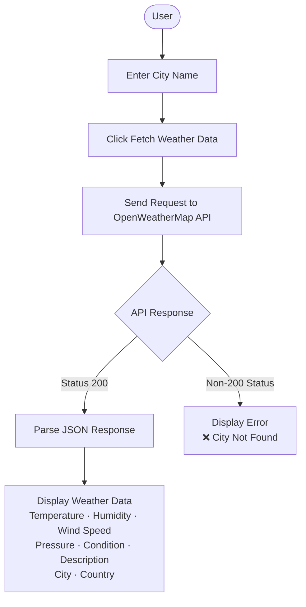

# 🌦️ Weather App

> A simple, real-time weather application built with Python and Streamlit that fetches current weather data for any city using the OpenWeatherMap API.

---

## 📋 Table of Contents

- [Project Overview](#-project-overview)
- [UI Preview](#-ui-preview)
- [Features](#-features)
- [Technologies Used](#-technologies-used)
- [How the Application Works](#-how-the-application-works)
- [Application Flow](#-application-flow)
- [Weather Data Displayed](#-weather-data-displayed)
- [Project Structure](#-project-structure)
- [Installation and Setup](#-installation-and-setup)
- [OpenWeatherMap API Configuration](#-openweathermap-api-configuration)
- [Running the Application](#-running-the-application)
- [API Integration](#-api-integration)
- [Error Handling](#-error-handling)
- [UI / Design](#-ui--design)
- [Future Enhancements](#-future-enhancements)
- [Advantages](#-advantages)
- [Limitations](#-limitations)
- [Learning Outcomes](#-learning-outcomes)
- [Author](#-author)
- [License](#-license)

---

## 📌 Project Overview

The Weather App is a lightweight, browser-based application that allows users to retrieve real-time weather information for any city in the world. It is built using Python and Streamlit, and powered by the OpenWeatherMap API.

The application allows users to:

- Enter a city name to look up.
- Fetch real-time weather information at the click of a button.
- View the current **temperature** (in °C).
- View the current **humidity** level.
- View the **wind speed**.
- View **atmospheric pressure**.
- View the general **weather condition** (e.g., Clear, Clouds, Rain).
- View a more **detailed weather description**.
- View the **city name and country** associated with the fetched data.

---

## 🖥️ UI Preview

)

The application features a clean, weather-themed interface:

- **Full-screen weather-themed background** — a custom background image (`background7.png`) is encoded in Base64 and applied via CSS to cover the entire viewport.
- **Weather App heading** — prominently displayed at the top with a weather emoji.
- **City input field** — a wide text input for entering the desired city name.
- **Fetch Weather Data button** — placed inline with the input field for a compact, responsive layout.
- **Responsive two-column input/button layout** — the input and button are arranged side-by-side using Streamlit's column system.
- **Metric-based weather cards** — weather data (temperature, humidity, wind speed, etc.) is displayed in a clean two-column grid of Streamlit metric components.
- **Dark/translucent interface elements** — Streamlit's default component styling creates a visual contrast against the background image.

---

## ✨ Features

- 🌍 **City-based weather search** — look up weather data for any city worldwide.
- 🌡️ **Temperature display** — current temperature shown in Celsius.
- 💧 **Humidity information** — relative humidity as a percentage.
- 🍃 **Wind speed information** — current wind speed in metres per second.
- 💨 **Atmospheric pressure** — pressure reading in millibars.
- 🌤️ **Weather condition** — high-level condition (Clear, Rain, Clouds, etc.).
- 📝 **Weather description** — detailed condition description from the API.
- 🌎 **Country information** — country code associated with the city.
- ⚡ **Real-time API-based weather data** — data is fetched live on every button click.
- ❌ **Invalid city error handling** — displays a clear error message when a city is not found.
- 🎨 **Custom background UI** — full-screen background image applied via Base64 encoding and CSS.
- 📱 **Streamlit responsive layout** — uses Streamlit columns for an adaptive, clean interface.

---

## 🛠️ Technologies Used

| Technology          | Purpose                          |
| ------------------- | -------------------------------- |
| Python              | Core application logic           |
| Streamlit           | Web interface and UI components  |
| Requests            | Sending HTTP API requests        |
| OpenWeatherMap API  | Source of real-time weather data |
| python-dotenv       | Loading environment variables    |
| Base64              | Encoding the background image    |
| HTML / CSS          | Custom background image styling  |

---

## ⚙️ How the Application Works

1. The application starts using the `streamlit run` command.
2. Environment variables are loaded from the `.env` file using `python-dotenv`.
3. The OpenWeatherMap API key is retrieved from the `WEATHER_API_KEY` environment variable.
4. The background image (`background7.png`) is read from disk and encoded to a Base64 string.
5. Custom CSS is injected into the Streamlit app to apply the background image to the full viewport.
6. The user enters a city name into the text input field.
7. The user clicks the **Fetch Weather Data** button.
8. The application constructs an API request URL and sends it to the OpenWeatherMap endpoint using the `requests` library.
9. The HTTP response status code is checked.
10. If the status is `200 OK`, the JSON response is parsed and the relevant weather fields are extracted.
11. The extracted weather data is displayed using Streamlit's `metric` components across a two-column grid layout.
12. If the status code is anything other than `200`, an error message — **"❌ City Not Found"** — is displayed to the user.

---

## 🔄 Application Flow



---

## 📊 Weather Data Displayed

The following fields are extracted from the OpenWeatherMap API JSON response:

| Data        | API Field                 | Unit / Format      |
| ----------- | ------------------------- | ------------------ |
| Temperature | `main.temp`               | °C                 |
| Humidity    | `main.humidity`           | %                  |
| Wind Speed  | `wind.speed`              | m/s                |
| Pressure    | `main.pressure`           | millibars (mb)     |
| Weather     | `weather[0].main`         | Condition label    |
| Description | `weather[0].description`  | Detailed condition |
| Country     | `sys.country`             | Country code       |
| City        | `name`                    | City name          |

---

## 📁 Project Structure

```text
Weather-App/
│
├── app.py               # Main Streamlit application (filename may vary)
├── background7.png      # Background image for the UI
├── .env                 # Environment variables (not committed to Git)
├── .gitignore           # Files and folders excluded from Git
├── requirements.txt     # Python dependencies
└── README.md            # Project documentation
```

> **Note:** The main Python file is referenced as `app.py` in this README. If your project uses a different filename (e.g., `main.py`, `weather_app.py`), use that name instead in all commands.

---

## 🚀 Installation and Setup

Follow the steps below to set up and run the project on your local machine.

### 1. Clone the Repository

```bash
git clone <YOUR_GITHUB_REPOSITORY_URL>
cd Weather-App
```

### 2. Create a Virtual Environment

**Windows:**
```bash
python -m venv venv
venv\Scripts\activate
```

**macOS / Linux:**
```bash
python3 -m venv venv
source venv/bin/activate
```

### 3. Install Dependencies

```bash
pip install streamlit requests python-dotenv
```

Alternatively, if a `requirements.txt` is present:

```bash
pip install -r requirements.txt
```

**Recommended `requirements.txt`:**
```text
streamlit
requests
python-dotenv
```

---

## 🔑 OpenWeatherMap API Configuration

### Step 1 — Obtain an API Key

1. Visit [https://openweathermap.org](https://openweathermap.org) and create a free account.
2. Navigate to **API Keys** under your account dashboard.
3. Copy your default API key (or generate a new one).

### Step 2 — Create a `.env` File

In the root directory of the project, create a file named `.env`:

```env
WEATHER_API_KEY=your_api_key_here
```

Replace `your_api_key_here` with your actual OpenWeatherMap API key.

### ⚠️ Important Security Notes

- **Do not hard-code** your API key directly in the Python source code.
- **Do not upload** the `.env` file to GitHub or any public repository.
- Add `.env` to your `.gitignore` file to prevent accidental exposure.

**Example `.gitignore`:**
```text
.env
venv/
__pycache__/
```

---

## ▶️ Running the Application

Once the setup is complete, start the application with:

```bash
streamlit run app.py
```

Streamlit will display a local URL in your terminal (typically `http://localhost:8501`). Open this URL in your browser to use the application.

---

## 🌐 API Integration

The application uses the **OpenWeatherMap Current Weather Data API**.

**Base endpoint:**
```text
https://api.openweathermap.org/data/2.5/weather
```

**Request parameters:**

| Parameter | Value          | Description                       |
| --------- | -------------- | --------------------------------- |
| `q`       | `{city_name}`  | Name of the city to look up       |
| `appid`   | `{API_KEY}`    | Your OpenWeatherMap API key       |
| `units`   | `metric`       | Returns temperature in Celsius    |

The API key is never hard-coded; it is loaded securely at runtime from the `.env` file using `python-dotenv`.

---

## 🛡️ Error Handling

The application implements basic response-status error handling:

- **Successful request (HTTP `200`)** — A success message is displayed, and all weather metrics are rendered.
- **Non-200 response** — An error message (`❌ City Not Found`) is shown to the user.

> Note: The current implementation does not include advanced exception handling (e.g., network timeouts, connection errors). This is noted as an area for future improvement.

---

## 🎨 UI / Design

The interface is designed to be clean and visually engaging:

- **Full-screen weather background** — `background7.png` is Base64-encoded and applied as a CSS `background-image` covering the full viewport.
- **Large application heading** — `🌦️ Weather App` is displayed prominently at the top.
- **City input and button row** — arranged in a wide column layout (9:4 ratio) so the input field and button sit side-by-side on the same row.
- **Metric-based weather cards** — weather data is displayed in pairs of Streamlit `st.metric` components across a two-column grid, providing a structured and readable layout.
- **Visual contrast** — Streamlit's default component backgrounds provide translucent contrast against the background image, keeping the text readable.

---

## 🔮 Future Enhancements

The following features are not currently implemented but represent realistic improvements for future development:

- 🌍 **Multi-day weather forecast** — extend from current weather to a 5–7 day forecast view.
- 📍 **Current location detection** — automatically fetch weather based on the user's geolocation.
- 🔎 **Improved city validation** — provide suggestions or handle ambiguous city names gracefully.
- 🌡️ **Celsius / Fahrenheit toggle** — allow users to switch between temperature units.
- 🌙 **Light / Dark theme** — offer a theme toggle for different viewing preferences.
- 🌧️ **Weather-specific icons and animations** — display icons relevant to the weather condition.
- 📊 **Weather charts** — visualise trends such as temperature changes over time.
- 🕒 **Search history** — remember previously searched cities within a session.
- 🌎 **Multiple location comparison** — display weather for several cities simultaneously.
- ⚠️ **Improved API and network error handling** — handle timeouts, connection failures, and API errors gracefully.
- 📱 **Further mobile UI optimisation** — refine layout behaviour on smaller screen sizes.

---

## ✅ Advantages

- **Simple, user-friendly interface** — minimal design makes the application easy to use for anyone.
- **Real-time weather data** — information is fetched live from the OpenWeatherMap API on every request.
- **Easy city-based search** — a straightforward text input is all that is needed.
- **Lightweight application** — minimal dependencies keep the project fast and easy to deploy.
- **Beginner-friendly Python project** — a practical starting point for developers learning Python and APIs.
- **API integration experience** — demonstrates how to authenticate, request, and parse data from a REST API.
- **Responsive Streamlit layout** — Streamlit's column system provides a clean, adaptive interface without additional front-end frameworks.

---

## ⚠️ Limitations

- **Requires an internet connection** — the application cannot function without access to the OpenWeatherMap API.
- **Requires a valid API key** — users must register on OpenWeatherMap and configure the `.env` file before running the app.
- **Current weather only** — the application displays present conditions and does not support forecasts.
- **Basic error handling** — only HTTP status codes are checked; network-level exceptions are not currently caught.
- **API dependency** — weather data accuracy and availability are entirely dependent on the external OpenWeatherMap service.

---

## 📚 Learning Outcomes

Developers working on or studying this project can gain practical experience with:

- **Python programming** — working with variables, conditions, functions, and libraries.
- **REST API integration** — constructing API requests, handling authentication, and processing responses.
- **JSON response handling** — parsing and extracting nested fields from API JSON payloads.
- **Environment variable management** — using `python-dotenv` to securely manage secrets.
- **Streamlit UI development** — building interactive web interfaces with Python.
- **CSS customisation in Streamlit** — injecting custom HTML/CSS to extend Streamlit's default styling.
- **Basic error handling** — responding to different API response codes in a user-friendly way.
- **Building a small real-world application** — end-to-end development from API integration to a deployed UI.

---

## 👤 Author

**Developed by: OM Shinde**

---

## 📄 License

License information can be added based on the repository requirements.
